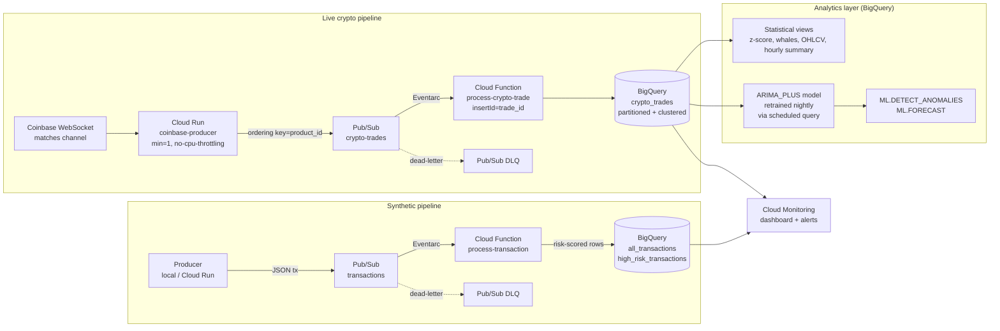

# Real-Time Analytics Engine on GCP

Two production data pipelines on Google Cloud, fully Terraformed: a synthetic-transaction risk-scoring pipeline and a **live Coinbase WebSocket feed** with two-layer anomaly detection (rolling z-score + BigQuery ML ARIMA_PLUS forecasting). End-to-end latency under two seconds.

[](https://github.com/JawadNM44/analytics-engine/actions/workflows/deploy.yml)


| | |
|---|---|
| **Live API** | https://crypto-api-jiuqt3hfoq-uc.a.run.app · auto-docs at [`/docs`](https://crypto-api-jiuqt3hfoq-uc.a.run.app/docs) |
| **End-to-end latency** | < 2 seconds (exchange → queryable BigQuery row) |
| **Sustained throughput** | ~5 trades/sec across 3 symbols (BTC, ETH, SOL) |
| **Trades processed (single 24h window)** | 508,615 trades · ~$432.9M USD volume · 0 errors |
| **Production incidents handled** | 6 (with postmortems in [`docs/PROJECT_DEFENSE.md`](docs/PROJECT_DEFENSE.md)) |
| **Monthly infra cost** | ~EUR 55 (94% from one always-on Cloud Run worker — see [`docs/COSTS.md`](docs/COSTS.md)) |
| **Tests** | 37/37 passing, no flaky |
| **Auth** | Keyless — no JSON service-account keys exist for this project |
| **Security model** | Threat model + verified absences in [`SECURITY.md`](SECURITY.md) |

---

## Architecture



---

## What this project demonstrates

- **End-to-end serverless data engineering** — WebSocket ingestion, message bus with ordering and DLQ, validated streaming inserts, partitioned + clustered analytics tables.
- **In-warehouse ML (BigQuery ML)** — `CREATE MODEL ... ARIMA_PLUS`, automated nightly retraining via BQ Data Transfer scheduled queries, `ML.DETECT_ANOMALIES` over confidence intervals — no external ML platform required.
- **Two-layer anomaly detection** — fast statistical baseline (60-min rolling z-score, |z| > 3) plus the ML model that catches what the z-score cannot (seasonal regime shifts, hour-of-day patterns).
- **Production-grade infrastructure-as-code** — every resource Terraformed, including IAM bindings, service-agent identities, scheduled queries, and propagation-aware sequencing (`time_sleep` for IAM eventual consistency).
- **CI/CD with keyless auth** — GitHub Actions exchanges OIDC tokens for short-lived GCP credentials via Workload Identity Federation. Zero JSON service-account keys exist in this project.
- **Real incident response** — six production incidents during build, each with a postmortem (artifact-handoff bug, Cloud Build SA permissions, IAM eventual-consistency, BQ service-agent lazy-creation, dataset-region mismatch, leaking Pub/Sub subscription that grew a 322k message backlog).
- **Cost-conscious design** — synthetic pipeline scales to zero. Crypto pipeline costs ~$60/month, dominated by the WebSocket worker which by definition cannot scale to zero.

---

## Live anomaly detection — example query

```sql
-- Surface volume anomalies in the last 6 hours,
-- as flagged by the nightly-retrained ARIMA_PLUS model.
SELECT
  product_id,
  minute,
  ROUND(volume_usd, 0)         AS volume_usd,
  ROUND(lower_bound, 0)        AS lower_bound,
  ROUND(upper_bound, 0)        AS upper_bound,
  ROUND(anomaly_probability, 3) AS prob
FROM ML.DETECT_ANOMALIES(
  MODEL `transactions_ds.model_crypto_volume_forecast`,
  STRUCT(0.95 AS anomaly_prob_threshold),
  (
    SELECT minute, product_id, volume_usd
    FROM `transactions_ds.view_crypto_volume_1m`
    WHERE minute >= TIMESTAMP_SUB(CURRENT_TIMESTAMP(), INTERVAL 6 HOUR)
  )
)
WHERE is_anomaly
ORDER BY minute DESC, anomaly_probability DESC;
```

Statistical alternative (works from minute one, no model required):

```sql
SELECT product_id, minute, volume_usd, z_score
FROM `transactions_ds.view_crypto_anomalies_zscore`
WHERE is_anomaly
ORDER BY minute DESC
LIMIT 50;
```

Ten more sample queries (forecasts, whale trades, OHLCV candles, model coefficients) live in [`analytics/bqml_queries.sql`](analytics/bqml_queries.sql).

Or call the API:

```bash
curl https://crypto-api-jiuqt3hfoq-uc.a.run.app/anomalies/recent?limit=10
curl https://crypto-api-jiuqt3hfoq-uc.a.run.app/price/BTC-USD
curl https://crypto-api-jiuqt3hfoq-uc.a.run.app/stats
```

---

## Tech stack

| Layer | Choice | Why this and not the obvious alternative |
|---|---|---|
| Streaming bus | **Pub/Sub** | Free under 10 GB/month; Kafka would be ~$100/month minimum at this scale |
| Always-on worker | **Cloud Run** (`min=1`, `--no-cpu-throttling`) | One container, no cluster. GKE would be overkill at one node. |
| Per-message processing | **Cloud Function 2nd Gen** | Cheaper than Dataflow at < 100 events/sec; simpler than a Beam pipeline |
| Analytics + ML | **BigQuery + BigQuery ML** | Data already lives there; ARIMA_PLUS auto-tunes and retrains via SQL |
| Idempotent inserts | **`insertId = trade_id`** | Built-in BigQuery dedup window handles at-least-once delivery |
| Ordering | **Pub/Sub ordering keys per `product_id`** | Preserves intra-symbol sequence without a stateful consumer |
| Infrastructure | **Terraform 1.7+** with GCS-backed state | Native object-generation locking; no DynamoDB workaround |
| CI/CD | **GitHub Actions + Workload Identity Federation** | No JSON keys to leak; short-lived OIDC-derived tokens only |
| Container build | **Cloud Build via dedicated `sa-function-build`** | Default compute SA on new GCP projects has zero permissions (security hardening) |

Full architectural rationale, alternatives considered, and trade-offs in [`docs/PROJECT_DEFENSE.md`](docs/PROJECT_DEFENSE.md).

---

## Repository layout

```
.
├── producer/             # Synthetic transaction producer (Python, Pub/Sub publisher)
├── producer-coinbase/    # Live Coinbase WebSocket → Pub/Sub bridge (Cloud Run)
├── function/             # Synthetic processor (validation + risk scoring → BigQuery)
├── function-crypto/      # Crypto-trade processor (validation → BigQuery)
├── analytics/
│   └── bqml_queries.sql  # Sample queries: views, ML.DETECT_ANOMALIES, ML.FORECAST
├── terraform/
│   ├── main.tf           # Providers, API enablement, GCS state backend
│   ├── pubsub.tf         # Topics, dead-letter, ordered subscriptions
│   ├── bigquery.tf       # Dataset, partitioned tables, analytical views
│   ├── crypto.tf         # Crypto pipeline (topic, table, function, OHLCV view)
│   ├── bqml.tf           # ARIMA_PLUS model + scheduled retraining + anomaly views
│   ├── cloud_function.tf # Synthetic processor function
│   ├── iam.tf            # Per-workload SAs, WIF for GitHub, IAM propagation gate
│   ├── monitoring.tf     # Dashboard + alert policies
│   └── outputs.tf
├── tests/                # 25 unit tests across both processors
├── docs/
│   └── PROJECT_DEFENSE.md  # Interview-prep script: decisions, postmortems, Q&A
└── .github/workflows/
    └── deploy.yml        # Test → Plan → Apply → Coinbase Cloud Run deploy
```

---

## Quick start

<details>
<summary>Prerequisites</summary>

| Tool | Version |
|------|---------|
| Python | 3.12+ |
| Terraform | 1.7+ |
| gcloud CLI | latest |
| A GCP project with billing enabled (free trial credits work) | — |

</details>

<details>
<summary>1. Configure</summary>

```bash
git clone https://github.com/JawadNM44/analytics-engine.git
cd analytics-engine

cp terraform/terraform.tfvars.example terraform/terraform.tfvars
# Set project_id and github_repo in terraform.tfvars
```

</details>

<details>
<summary>2. Authenticate locally</summary>

```bash
gcloud auth application-default login
gcloud config set project YOUR_PROJECT_ID
```

</details>

<details>
<summary>3. Deploy</summary>

```bash
cd terraform
terraform init
terraform plan -out=tfplan
terraform apply tfplan
```

This provisions: Pub/Sub topics, BigQuery dataset + tables + views, Cloud Functions, the Cloud Run service for the Coinbase producer, all IAM bindings, the BQML scheduled query, and the Cloud Monitoring dashboard.

</details>

<details>
<summary>4. Run a synthetic load (optional)</summary>

```bash
cd producer
pip install -r requirements.txt
export GCP_PROJECT_ID=your-project-id
export TOTAL_MESSAGES=100000
python main.py
```

</details>

<details>
<summary>5. Verify the live crypto feed</summary>

The Coinbase producer is deployed and connected by the Apply step. Check it:

```bash
gcloud run services logs read coinbase-producer --region us-central1 --limit 30
# Expect heartbeat lines every 30s with non-zero trade counts.

bq query --use_legacy_sql=false \
  'SELECT product_id, COUNT(*) AS trades, MAX(trade_time) AS latest
   FROM `YOUR_PROJECT.transactions_ds.crypto_trades`
   GROUP BY product_id'
```

</details>

---

## CI/CD

Pipeline runs on every push and pull request:

```
PR/push  →  Unit Tests  →  Terraform Fmt + Validate + Plan
                                                  │
                                       push to main only
                                                  ▼
                              Terraform Apply (manual approval via
                              GitHub Environments: "production")
                                                  │
                                                  ▼
                        Deploy coinbase-producer to Cloud Run (--source)
```

Authentication is keyless via Workload Identity Federation. Required repository secrets:

| Secret | Value |
|---|---|
| `GCP_PROJECT_ID` | The GCP project ID |
| `WIF_PROVIDER` | `projects/PROJECT_NUMBER/locations/global/workloadIdentityPools/github-pool/providers/github-provider` |
| `WIF_SA_EMAIL` | `sa-github-cicd@PROJECT_ID.iam.gserviceaccount.com` |
| `ALERT_EMAIL` | (optional) destination for Cloud Monitoring alert notifications |

---

## Engineering choices worth highlighting

<details>
<summary>Why two layers of anomaly detection?</summary>

The rolling z-score works from minute one but assumes stationary, normally distributed volume. It mis-flags every busy market open as an anomaly because it has no concept of seasonality.

The ARIMA_PLUS model learns hour-of-day, day-of-week, and trend components per symbol. It doesn't flag a busy Monday morning as an anomaly because it knows that's normal. But it needs ~24 hours of data before it's useful.

Running both gives immediate coverage from the z-score plus higher-recall detection from the model — which is how Stripe, Netflix, and most fraud-detection systems work in practice.

</details>

<details>
<summary>Why Cloud Run for a 24/7 worker (and not a VM)?</summary>

Cloud Run with `min-instances=1` and `--no-cpu-throttling` gives the same always-on guarantees as a VM but with managed deploy, secrets, healthchecks, autoscaling on bursts, and zero infrastructure to maintain. The cost premium over a Hetzner-style VM (~$50/month vs ~$5) is paid for in operational simplicity.

If cost mattered more than reliability, a `e2-micro` Compute Engine instance would be the obvious switch. For a portfolio project, the deployment story matters more.

</details>

<details>
<summary>Why bother with Workload Identity Federation?</summary>

JSON service-account keys are the single largest source of GCP credential leaks. They get committed to git, leak through container logs, end up in screenshots — and bots scan GitHub continuously for them.

WIF gives GitHub Actions a one-time ability to exchange its OIDC token for a short-lived GCP token, scoped to a specific repository via `attribute.repository == 'JawadNM44/analytics-engine'`. **There is no static credential to leak.** This is one of the cheapest security wins available on GCP and the setup is one-time.

</details>

<details>
<summary>What did I get wrong, and what would I do differently?</summary>

Six honest postmortems live in [`docs/PROJECT_DEFENSE.md`](docs/PROJECT_DEFENSE.md), section 4. The most embarrassing one: I declared a Pub/Sub subscription "for inspection" without a consumer, and it accumulated a 322,000-message backlog within hours before the alert fired. Fix was a one-line resource removal in Terraform; lesson is to never declare a subscription without a planned consumer.

Other surprises documented there: GCP IAM is eventually consistent (~60s propagation), service-agent SAs are lazy-created on first API use, and BigQuery `US` (multi-region) is not the same location as `us-central1`.

</details>

---

## Cost breakdown

| Service | What | Estimated USD/month |
|---|---|---|
| Cloud Run `coinbase-producer` | 1 instance, 512 MiB, 1 vCPU, always-on (`--no-cpu-throttling`) | $50–65 |
| Cloud Run `process-crypto-trade` | scale-to-zero, sub-second invocations | < $1 |
| Cloud Run `process-transaction` | scale-to-zero, only active during synthetic load | < $1 |
| BigQuery storage | ~80 MB total — well within 10 GB free tier | $0 |
| BigQuery queries | views + nightly BQML training, low scan volume | < $1 |
| BQML training | one nightly `CREATE OR REPLACE MODEL` run, ~10 MB scan | < $0.01 |
| Pub/Sub | < 1 GB/month — within 10 GB free tier | $0 |
| Cloud Build (deploys) | within 120 build-minutes/day free tier | $0 |
| Logging + Monitoring | within free tier | $0 |
| **Total** | | **~$50–65** |

The Cloud Run worker is the dominant cost because a WebSocket consumer cannot scale to zero. The rest of the system is essentially free at this volume.

---

## Documentation

- [`docs/PROJECT_DEFENSE.md`](docs/PROJECT_DEFENSE.md) — interview script: 8 architectural decisions with trade-offs, six incident postmortems, 20-question follow-up bank.
- [`docs/COSTS.md`](docs/COSTS.md) — concrete monthly burn breakdown, levers to reduce spend, free-trial vs always-free explainer.
- [`docs/DASHBOARD_SETUP.md`](docs/DASHBOARD_SETUP.md) — 20-minute Looker Studio dashboard build using the `view_dashboard_*` views.
- [`SECURITY.md`](SECURITY.md) — threat model (3 adversaries), per-workload service-account scopes, verified absences.
- [`producer-coinbase/README.md`](producer-coinbase/README.md) — WebSocket producer details and local dev.
- [`api-public/README.md`](api-public/README.md) — public REST API endpoints, configuration, cost protection.
- [`analytics/bqml_queries.sql`](analytics/bqml_queries.sql) — ten runnable example queries for every view and ML function.

---

## License

MIT
